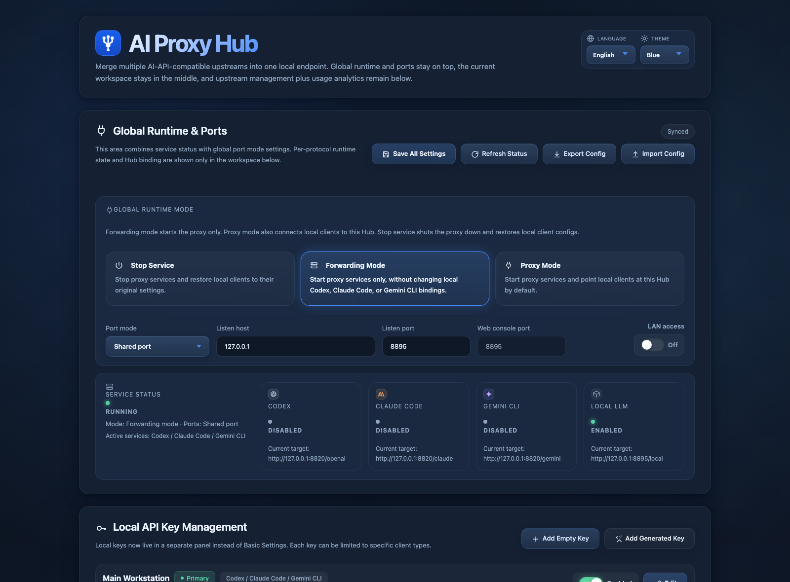
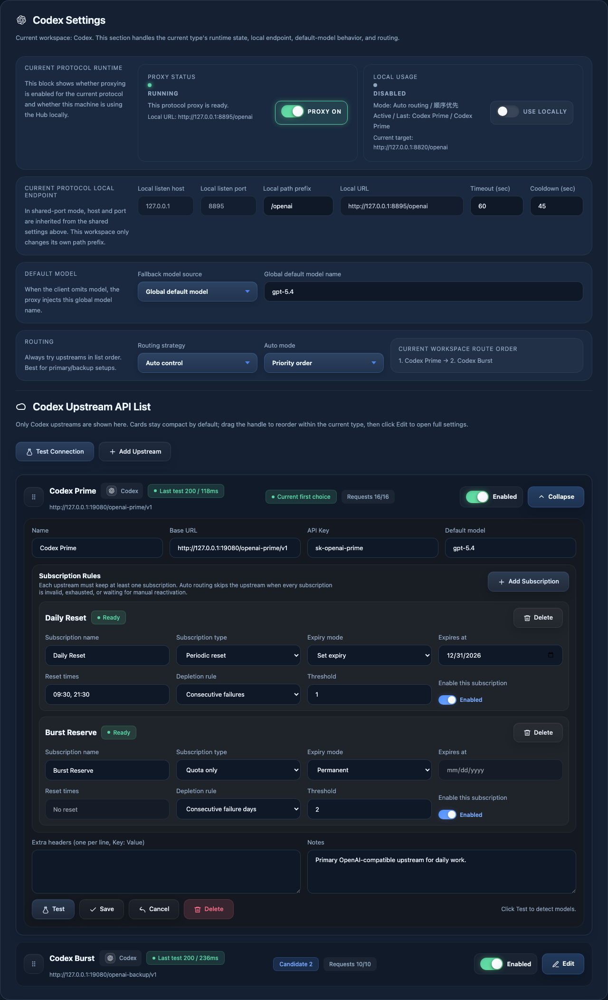
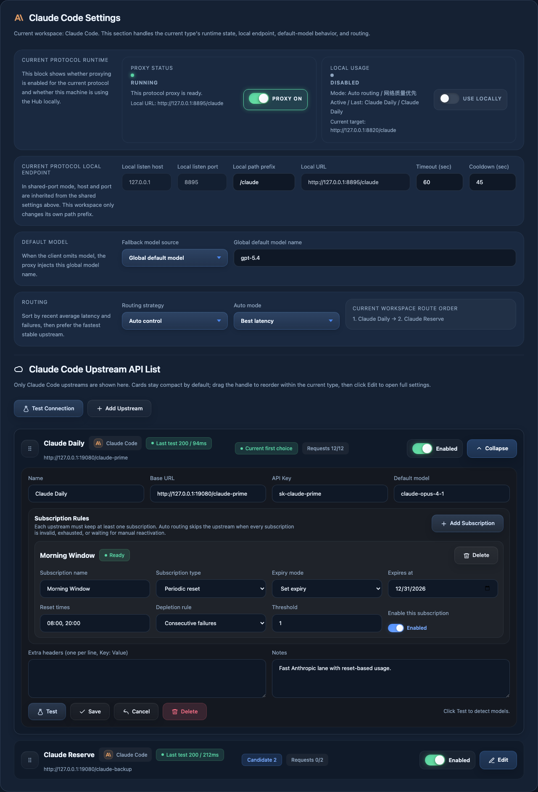
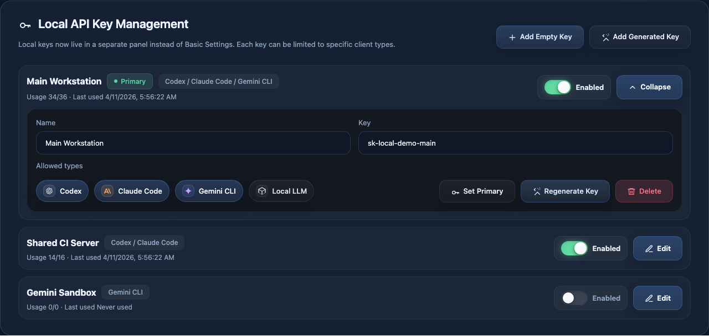
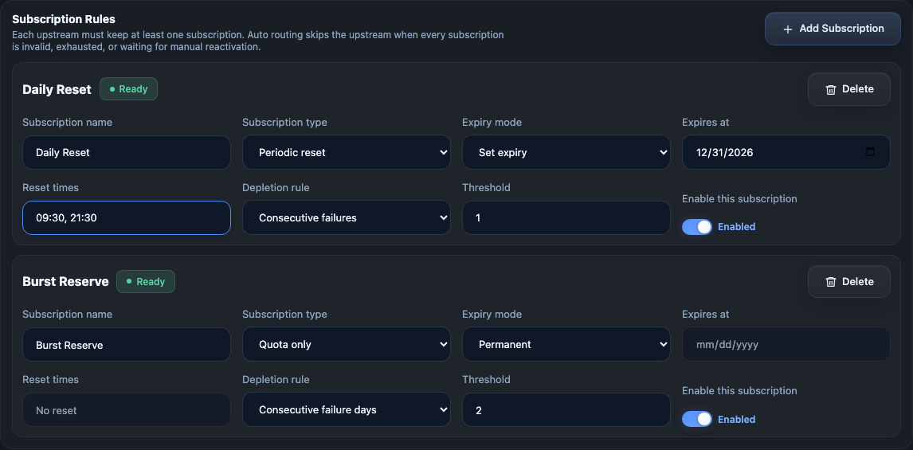
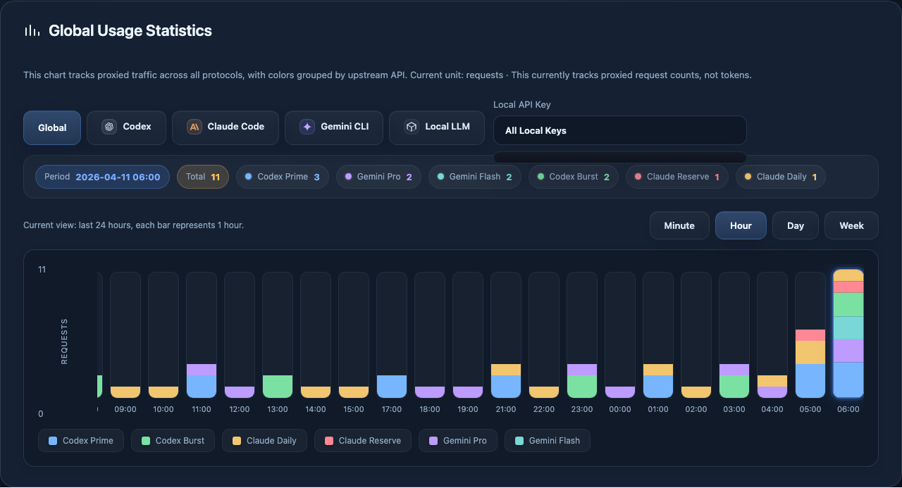
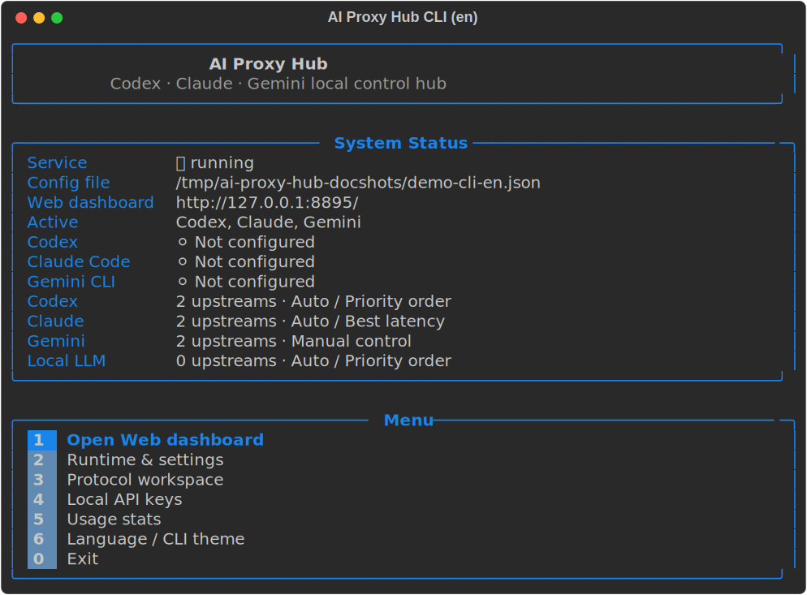

# AI Proxy Hub

English | [简体中文](README.zh-CN.md)

[](https://github.com/weicj/ai-proxy-hub/releases)
[](https://github.com/weicj/ai-proxy-hub/actions/workflows/ci.yml)


[](https://github.com/weicj/homebrew-aiproxyhub)


[](LICENSE)

AI Proxy Hub is a cross-platform local gateway for AI clients and upstream APIs. It unifies multiple upstream endpoints behind one local control plane, adds protocol-aware routing and failover, and provides both a Web dashboard and an interactive CLI.

## Highlights

- One local hub for multiple AI clients
  AI Proxy Hub can sit between local tools and multiple upstream providers, so Codex, Claude Code, Gemini CLI, and compatible clients can share one managed entrypoint.
- Multi-upstream routing with real failover
  Upstreams can be routed in manual mode or automatic mode, with priority routing, round-robin balancing, and latency-aware ordering.
- Protocol-aware local endpoints
  OpenAI-compatible, Claude / Anthropic, and Gemini-style paths are exposed separately, so different client ecosystems can coexist behind one hub.
- Subscription-aware upstream control
  Each upstream can carry one or more subscriptions, including unlimited, periodic-reset, and quota-style plans, with expiry dates and automatic availability handling.
- Full local control surface
  The project includes both a Web UI and a rich CLI console for service control, upstream management, local API key management, routing changes, and usage inspection.
- Operational visibility built in
  Usage can be observed over time by protocol, by upstream, and by local API key, making it easier to see where traffic is going and which channels are carrying load.
- Flexible deployment shape
  Shared-port mode and split-port mode are both supported, with optional LAN exposure for local network use.
- Local-first, self-hosted workflow
  Configuration is stored on the user machine, old configs can be migrated automatically, and the hub is designed for local or private network operation rather than public multi-tenant hosting.

## Why AI Proxy Hub

Many local AI setups start as a single-client, single-upstream configuration and then gradually become operationally messy:

- one client needs a backup endpoint
- another client uses a different protocol family
- one channel resets daily while another is quota-based
- local API keys need separation by user, machine, or workflow
- switching between endpoints becomes manual and error-prone

AI Proxy Hub is built for that transition point. It keeps the client-facing side stable while moving the unstable part of the system into one managed layer:

- upstream selection
- failure handling
- subscription timing
- local key control
- runtime visibility

## Interface Preview

### Web dashboard

<table>
  <tr>
    <td><strong>Runtime overview</strong><br></td>
    <td><strong>Codex workspace</strong><br></td>
    <td><strong>Claude workspace</strong><br></td>
  </tr>
  <tr>
    <td><strong>Local API key management</strong><br></td>
    <td><strong>Subscription editor</strong><br></td>
    <td><strong>Global usage analytics</strong><br></td>
  </tr>
</table>

The Web dashboard is designed as an operational console rather than a static settings page. It surfaces:

- runtime overview and service state
- protocol-specific workspaces
- upstream API management
- local API key management
- usage charts by protocol, upstream, and local key
- import, export, and runtime control actions

### Interactive CLI

<p></p>

The CLI is designed for terminal-first administration, especially for SSH-driven workflows. It provides:

- direct service control
- protocol workspace navigation
- upstream inspection and editing
- local key management
- usage inspection
- theme and language switching
- a quick path into the Web console when a browser is available

## What AI Proxy Hub Solves

Modern AI workflows often depend on multiple upstream endpoints:

- a primary endpoint for daily use
- one or more backup endpoints for failover
- different endpoints for different protocols
- quota-based or time-reset channels that need careful ordering
- separate clients with different local configuration formats

AI Proxy Hub provides a single local control layer for that complexity. Instead of rewriting client configuration every time an upstream changes, the hub keeps the client-facing side stable and moves routing logic, subscription handling, key management, and observability into one place.

## Feature Comparison

| Capability | AI Proxy Hub | Simple single-upstream proxy | Manual client reconfiguration |
| --- | --- | --- | --- |
| Multiple named upstreams | Yes | Usually no | Manual only |
| Automatic failover | Yes | Limited | No |
| Per-protocol workspaces | Yes | Rare | No |
| Subscription-aware availability | Yes | No | No |
| Local API key management | Yes | Rare | No |
| Usage breakdown by upstream and key | Yes | Limited | No |
| Web UI and interactive CLI | Yes | Usually one or neither | No |
| Shared-port and split-port runtime modes | Yes | Rare | No |
| Client switching for Codex / Claude / Gemini flows | Yes | No | Manual only |

## Core Capabilities

### Unified local gateway

- Stable local base URLs for supported protocols
- Stable local API key model for downstream clients
- Compatible local routing surface for Codex, Claude Code, Gemini CLI, and similar tools

### Upstream management

- Named upstream definitions
- Enable / disable controls
- Per-upstream default model
- Per-upstream connection testing
- Manual ordering and drag-based priority management in the Web UI
- Collapsed list view with status, latency, activity, and recent health state

### Routing control

- Manual control
- Automatic routing
- Priority routing
- Round-robin routing
- Latency-aware routing
- Per-protocol routing settings
- Manual active upstream selection when automatic mode is disabled

### Subscription-aware availability

- Unlimited subscriptions
- Periodic reset subscriptions
- Quota-style subscriptions
- Expiry dates per subscription
- Temporary freezing and later recovery for reset-based channels
- Manual re-enable flow when a channel requires human review

### Local API key management

- Multiple local keys
- Named keys
- Enable / disable control
- Primary key selection
- Regeneration support
- Per-key protocol allowlists
- Usage visibility per local key

### Control surfaces

- Interactive CLI console
- Web dashboard
- Theme support
- Chinese / English interface with i18n-oriented structure for future expansion

### Runtime and deployment options

- Shared-port mode
- Split-port mode
- Configurable Web UI port
- Optional LAN access
- Forwarding mode
- Proxy mode
- Per-protocol start / stop control

### Observability

- Usage over time
- Time buckets by minute, hour, day, and week
- Breakdown by protocol
- Breakdown by upstream
- Breakdown by local API key

### Distribution and release tooling

- Portable `.tar.gz` and `.zip` release artifacts
- Optional `.deb` generation when `dpkg-deb` is available
- Generated metadata for Homebrew and winget workflows
- Release artifact verification script
- Local release snapshot sync workflow

## Supported Client and Protocol Model

AI Proxy Hub currently focuses on three primary client ecosystems:

- `Codex`
- `Claude Code`
- `Gemini CLI`

It exposes local protocol workspaces for:

- `OpenAI-compatible`
- `Claude / Anthropic`
- `Gemini`

In shared-port mode, the default local paths are:

- `/openai`
- `/claude`
- `/gemini`

Typical local request examples:

```bash
curl http://127.0.0.1:8787/openai/v1/chat/completions \
  -H "Authorization: Bearer sk-local-demo" \
  -H "Content-Type: application/json" \
  -d '{
    "model": "gpt-4.1-mini",
    "messages": [{"role": "user", "content": "hello"}]
  }'
```

```bash
curl http://127.0.0.1:8787/openai/v1/models \
  -H "Authorization: Bearer sk-local-demo"
```

## Architecture Overview

AI Proxy Hub is structured around three layers:

1. Client-facing local endpoints
2. Routing, subscription, and control logic
3. Upstream provider connections

Simplified request flow:

```text
Client / CLI / SDK
        |
        v
AI Proxy Hub local endpoint
        |
        v
Routing + policy + subscription state
        |
        v
Selected upstream API
```

The repository keeps the backend, Web frontend, CLI runtime, release tooling, and tests in separate areas so the project can evolve without collapsing back into a single-file tool.

## Quick Start

### Installation

### Available now

#### Source checkout

```bash
git clone https://github.com/weicj/ai-proxy-hub.git
cd ai-proxy-hub
pip install rich
python3 aiproxyhub.py
```

#### Portable release archive

Use the GitHub Release `.tar.gz` or `.zip` artifact, extract it locally, then run:

```bash
pip install rich
python3 aiproxyhub.py
```

#### Debian / Ubuntu local package

When a `.deb` artifact is provided in a release, install it with:

```bash
sudo apt install ./ai-proxy-hub_<version>_all.deb
```

or:

```bash
sudo dpkg -i ai-proxy-hub_<version>_all.deb
```

### Package-manager channels

Homebrew tap is published in preview. If you want the lowest-risk install path right now, prefer source checkout or the GitHub Release archive first.

```bash
brew tap weicj/aiproxyhub
brew install ai-proxy-hub
```

The following public package-manager lanes are still being prepared:

```bash
winget install AIProxyHub.AIProxyHub
sudo apt install ai-proxy-hub
```

### Prerequisites

- Python `3.9+`
- `rich` for the full interactive CLI experience

Install the runtime dependency:

```bash
pip install rich
```

### Start the interactive console

```bash
python3 aiproxyhub.py
```

### Start the interactive console via module entrypoint

```bash
python3 -m ai_proxy_hub
```

If installed as a package:

```bash
ai-proxy-hub
```

### Start the HTTP service directly

```bash
python3 aiproxyhub.py --serve
```

### Start the HTTP service via module entrypoint

```bash
python3 -m ai_proxy_hub --serve
```

### Print resolved runtime paths

```bash
python3 -m ai_proxy_hub --print-paths
```

### Change the listening address or port

```bash
python3 -m ai_proxy_hub --serve --host 127.0.0.1 --port 8799
```

For a source checkout, `aiproxyhub.py` is now the clearest launcher. The package command `ai-proxy-hub` provides the same entrypoint after installation. The older `start.py` and `router_server.py` files are kept only for backward compatibility.

## Configuration Model

### Workspaces

The project is organized around protocol-specific workspaces rather than one flat upstream list. Each workspace can maintain:

- its own local entry settings
- its own default model strategy
- its own routing mode
- its own upstream ordering

### Port modes

Two runtime modes are supported:

- `Shared port`
  One API listening port with protocol paths such as `/openai`, `/claude`, and `/gemini`
- `Split port`
  Separate listening ports for different protocol families

### Service modes

- `Stopped`
- `Forwarding mode`
  The local proxy runs, but local client switching is not automatically enabled
- `Proxy mode`
  The local proxy runs and the hub can be used as the active local endpoint for supported clients

## Routing and Subscription Semantics

### Routing modes

- `Manual control`
  Uses the manually selected upstream for that protocol
- `Priority routing`
  Walks the configured upstream order and falls through on real upstream failure
- `Round-robin routing`
  Rotates start position for each new request
- `Latency-aware routing`
  Prefers upstreams with better observed network quality

### Subscription behavior

Upstreams can contain multiple subscriptions. This is useful for setups such as:

- one daily reset plan for primary use
- one secondary reset window later in the day
- one quota-based emergency fallback channel

The hub can temporarily freeze an exhausted or unavailable subscription-backed route and later re-check it when the next reset window arrives. Manual routing is intentionally insulated from automatic recovery logic.

## Web Dashboard

The Web dashboard is designed for operational control rather than static configuration only. It includes:

- runtime overview
- protocol workspaces
- upstream API management
- local API key management
- usage charts
- import / export flows
- theme switching
- language switching

The dashboard is intended to make ongoing routing operations visible, not just initial setup.

## Interactive CLI

The CLI is a first-class control surface, not a fallback utility. It provides:

- interactive menus
- service start / stop controls
- Web console launch shortcut
- protocol workspace navigation
- upstream inspection and editing
- local API key controls
- usage inspection
- language and CLI theme controls

The CLI is especially useful when the service is managed over SSH or on systems where a browser is not the primary control surface.

## Configuration Paths and Migration

Default config locations follow platform conventions:

- macOS: `~/Library/Application Support/AI Proxy Hub/api-config.json`
- Linux: `${XDG_CONFIG_HOME:-~/.config}/ai-proxy-hub/api-config.json`
- Windows: `%APPDATA%\\AI Proxy Hub\\api-config.json`

The project can also seed or migrate from earlier local config locations used by previous tool names.

## Security and Operational Boundaries

AI Proxy Hub is designed as a local or private-network control plane.

It includes:

- request body size limits
- input validation
- safe response headers
- local-first default binding
- explicit LAN exposure control

It is not positioned as a hardened public multi-tenant Internet gateway. For public deployment, additional reverse proxy, auth, rate limiting, secret management, and network hardening layers would still be required.

## Project Structure

The repository is divided into clear areas:

- `ai_proxy_hub/`
  backend package and runtime logic
- `web/`
  Web dashboard assets
- `tests/`
  automated tests
- `scripts/`
  build, verification, sync, and release tooling
- `docs/`
  supporting project and release documentation
- `examples/`
  example configuration and environment templates

Additional documentation:

- [Project Structure](docs/PROJECT_STRUCTURE.md)
- [Release Workflow](docs/RELEASE_WORKFLOW.md)
- [External Test Environments](docs/EXTERNAL_TEST_ENV.md)
- [FAQ](docs/FAQ.md)

## Testing

Run the full automated test suite:

```bash
python3 -m unittest discover -s tests -v
```

## Build and Release

### Build release artifacts

```bash
python3 scripts/build_release.py --version 0.3.1
```

### Verify release artifacts

```bash
python3 scripts/verify_release_artifacts.py --dist-dir dist --version 0.3.1
```

### Run release preflight

```bash
python3 scripts/release_preflight.py --version 0.3.1
```

### Sync the current source tree into the local release workspace

```bash
python3 scripts/sync_release_snapshot.py --version 0.3.1
```

### Sync the generated Homebrew formula into a tap checkout

```bash
python3 scripts/sync_homebrew_tap.py \
  --formula dist/release-metadata/ai-proxy-hub.rb \
  --tap-root ~/Develop/AI\ Proxy\ Hub/homebrew-aiproxyhub \
  --tap-repo weicj/homebrew-aiproxyhub \
  --version 0.3.1
```

### Run a remote Linux smoke test

```bash
python3 scripts/run_remote_linux_smoke.py \
  --ssh user@linux-host \
  --identity-file ~/.ssh/id_ed25519 \
  --artifact dist/ai-proxy-hub-0.3.1.tar.gz
```

### Current artifact targets

- `.tar.gz` for GitHub Releases and Homebrew-oriented flows
- `.zip` for Windows portable distribution and winget-oriented flows
- `.deb` when Debian packaging tools are available

## Current Limitations

- Streaming responses cannot be re-routed after a stream has already started
- Listener address and port changes still require a restart
- Public multi-tenant gateway use is outside the primary design target
- Package-registry distribution flows are still being finalized

## FAQ

### Is AI Proxy Hub only for OpenAI-compatible APIs?

No. The project currently exposes protocol workspaces for OpenAI-compatible, Claude / Anthropic, and Gemini-style request flows.

### Can it be used only on macOS?

No. The project is intended to run on macOS, Linux, and Windows. Release tooling and external smoke workflows are also being shaped around cross-platform use.

### Does it require root or administrator privileges?

Runtime should not require root or administrator privileges. The normal target is user-level execution with user-writable config directories.

For installation, elevated privileges are acceptable when the platform expects them, for example:

- `sudo apt install ./ai-proxy-hub_<version>_all.deb`
- `sudo dpkg -i ai-proxy-hub_<version>_all.deb`

That distinction matters: installation may use `sudo`, but day-to-day running should still work as a normal user.

### Is it meant to be a public Internet gateway?

No. It is designed primarily as a local or private-network control plane. Public deployment would need additional security layers outside the project itself.

### Can one local key be restricted to specific protocol families?

Yes. Local API keys can be limited by protocol scope, which makes it possible to separate Codex, Claude Code, Gemini, or other workflow access patterns.

### Where is the longer FAQ?

See [docs/FAQ.md](docs/FAQ.md).

## Roadmap

- PyPI publication
- APT-oriented release flow
- winget submission workflow
- broader language packs on top of the current i18n structure
- more themes and UI refinement
- continued protocol and client ecosystem expansion

## Contributing

Issues, bug reports, design feedback, and pull requests are welcome.

For contributors:

- keep runtime secrets and local machine credentials out of the repository
- prefer tests for behavioral changes
- use the release verification scripts before preparing public artifacts

## License

AI Proxy Hub is licensed under the Apache License 2.0.

- [LICENSE](LICENSE)
- [NOTICE](NOTICE)
