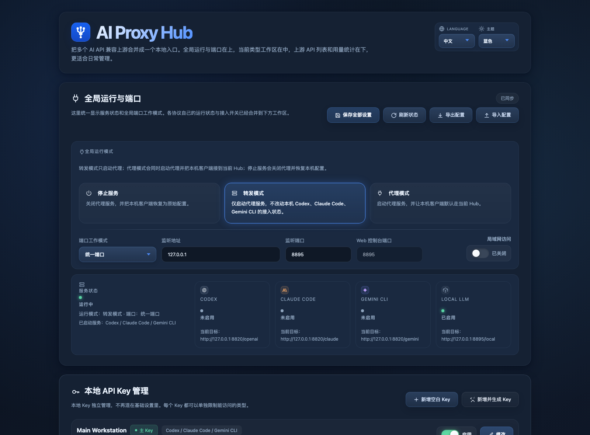
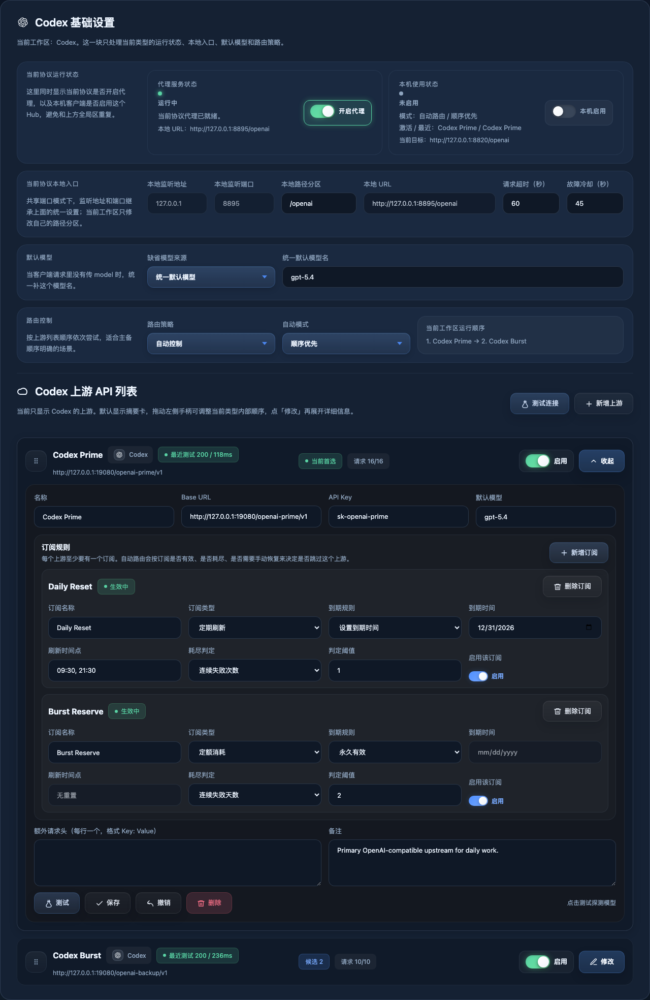
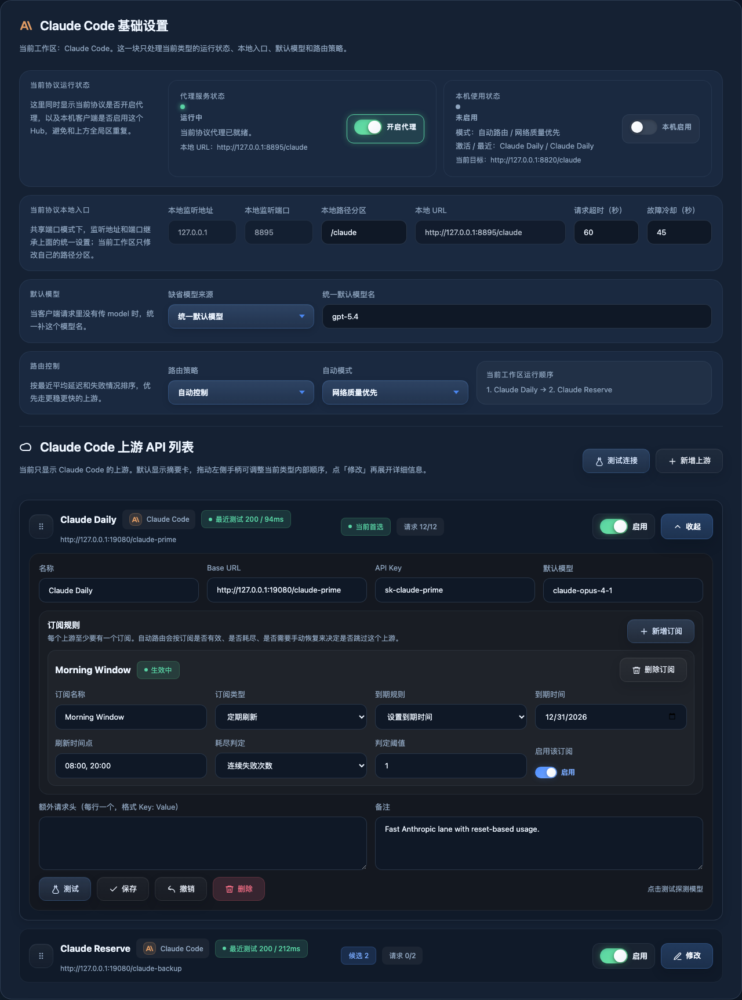
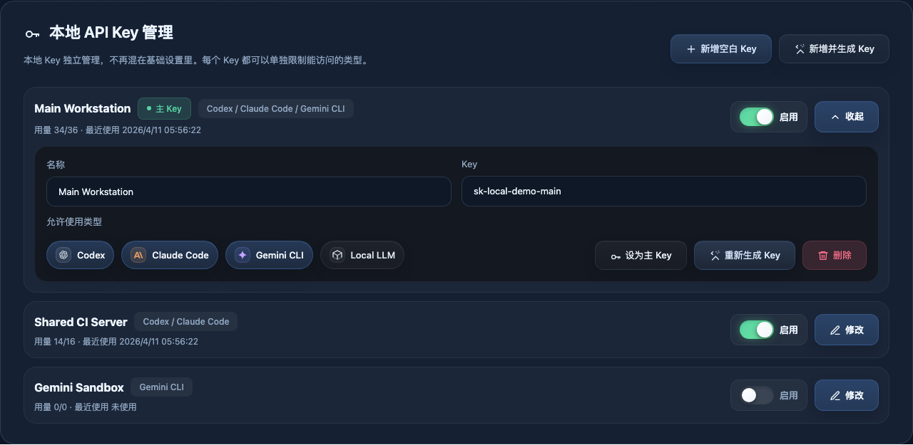
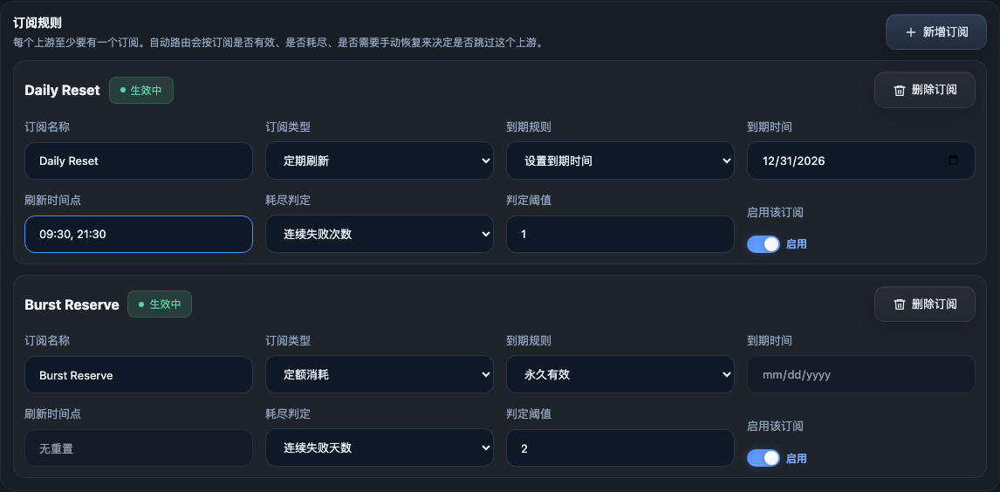
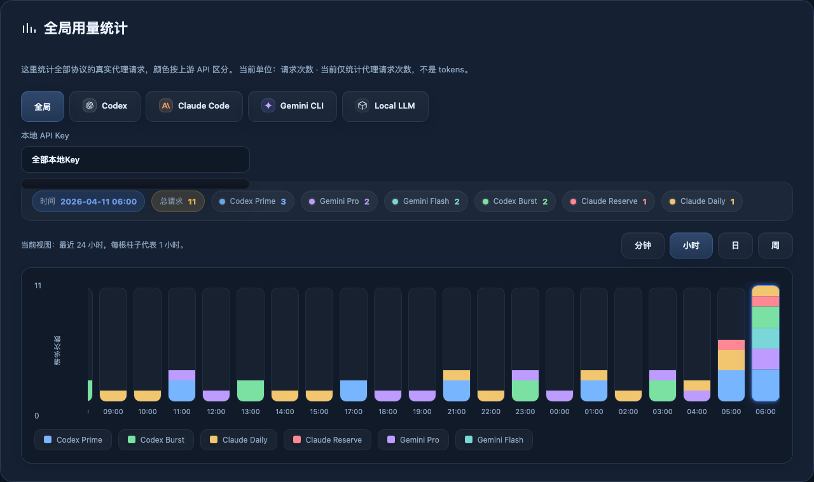
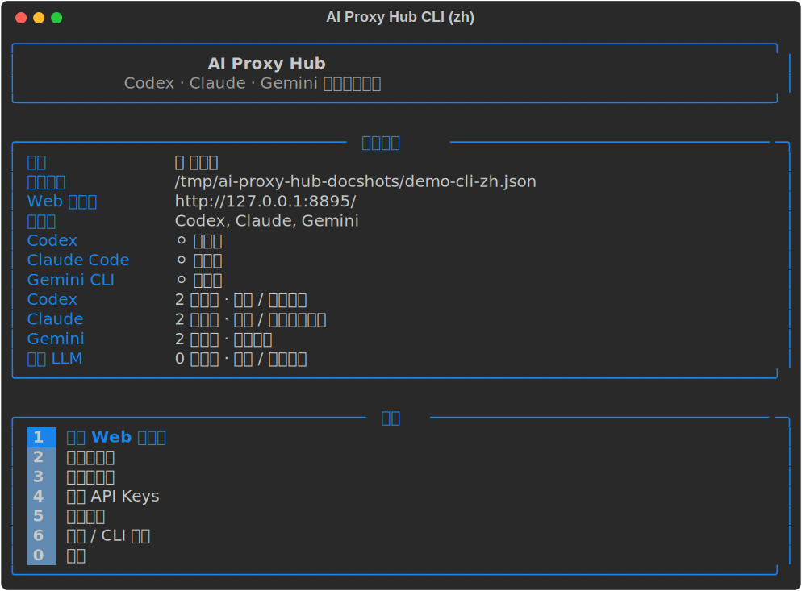

# AI Proxy Hub

[English](README.md) | 简体中文

[](https://github.com/weicj/ai-proxy-hub/releases)
[](https://github.com/weicj/ai-proxy-hub/actions/workflows/ci.yml)


[](https://github.com/weicj/homebrew-aiproxyhub)


[](LICENSE)

AI Proxy Hub 是一个跨平台的本地 AI 网关，用于把多个上游 API 统一到一个本地控制平面之下。它提供协议感知路由、故障切换、上游订阅管理、本地 API Key 管理，以及 Web 控制台和交互式 CLI。

## 项目亮点

- 一个本地 Hub，统一管理多个 AI 客户端
  AI Proxy Hub 可以位于本地工具与多个上游服务之间，让 Codex、Claude Code、Gemini CLI 以及兼容客户端共享同一个受控入口。
- 多上游路由与真实故障切换
  支持手动模式和自动模式，并内置顺序优先、轮询负载、网络质量优先等路由策略。
- 协议感知的本地入口
  OpenAI 兼容、Claude / Anthropic、Gemini 三类本地路径可独立暴露，便于不同客户端生态共存。
- 订阅感知的上游控制
  每个上游可以配置一个或多个订阅，支持无限制、周期重置、定额消耗等模式，并带到期时间和可用性处理逻辑。
- 完整的本地控制面
  项目同时提供 Web 控制台和富文本 CLI 控制台，可用于服务启停、上游管理、本地 Key 管理、路由调整和用量查看。
- 内置运行可观测性
  用量统计支持按协议、按上游、按本地 API Key 维度查看，便于分析负载去向和渠道占用情况。
- 灵活的运行形态
  支持统一端口和独立端口模式，也支持是否开启局域网访问。
- 本地优先、自托管工作流
  配置默认保存在当前用户目录，可自动迁移旧配置，设计目标是本地或私有网络环境，而不是公网多租户网关。

## 为什么选择 AI Proxy Hub

很多本地 AI 使用环境一开始都很简单，但很快就会进入运维复杂化阶段：

- 一个客户端需要备用上游
- 另一个客户端使用完全不同的协议族
- 一个渠道按天重置，另一个按额度消耗
- 本地 API Key 需要按用户、机器或用途拆分
- 上游一旦变化，就要手动重配多个客户端

AI Proxy Hub 面向的就是这个阶段。它尽量保持客户端一侧稳定，把真正容易变化的部分集中到一个统一控制层中：

- 上游选择
- 故障处理
- 订阅时序
- 本地 Key 管理
- 运行可视化

## 界面预览

### Web 控制台

<table>
  <tr>
    <td><strong>运行总览</strong><br></td>
    <td><strong>Codex 工作区</strong><br></td>
    <td><strong>Claude 工作区</strong><br></td>
  </tr>
  <tr>
    <td><strong>本地 API Key 管理</strong><br></td>
    <td><strong>订阅编辑器</strong><br></td>
    <td><strong>全局用量统计</strong><br></td>
  </tr>
</table>

Web 控制台的定位不是静态配置页，而是运行控制台。它主要承载：

- 运行总览和服务状态
- 分协议工作区
- 上游 API 管理
- 本地 API Key 管理
- 按协议、上游、本地 Key 维度展示的用量图表
- 导入、导出与运行时控制操作

### 交互式 CLI

<p></p>

CLI 面向终端优先的管理场景，尤其适合 SSH 环境。它主要提供：

- 直接的服务控制
- 协议工作区导航
- 上游查看与编辑
- 本地 Key 管理
- 用量查看
- 主题与语言切换
- 浏览器可用时快速跳转 Web 控制台

## AI Proxy Hub 解决的问题

在真实 AI 使用场景里，往往会同时面对这些问题：

- 一个日常主用上游
- 一个或多个故障切换备用上游
- 不同协议需要不同的接入地址
- 按日重置、按时段重置、按额度消耗的复杂订阅组合
- 不同客户端各自维护不同格式的本地配置

AI Proxy Hub 的目标，就是把这些复杂性集中到一个本地控制层中。客户端侧配置尽量保持稳定，而把路由逻辑、订阅状态、Key 管理和运行可视化统一收口到同一个 Hub。

## 功能对比

| 能力 | AI Proxy Hub | 简单单上游代理 | 手动重配客户端 |
| --- | --- | --- | --- |
| 多个可命名上游 | 支持 | 通常不支持 | 只能手工维护 |
| 自动故障切换 | 支持 | 能力有限 | 不支持 |
| 按协议独立工作区 | 支持 | 少见 | 不支持 |
| 订阅感知的可用性控制 | 支持 | 不支持 | 不支持 |
| 本地 API Key 管理 | 支持 | 少见 | 不支持 |
| 按上游和 Key 拆分的用量可视化 | 支持 | 能力有限 | 不支持 |
| Web UI 与交互式 CLI | 同时支持 | 通常只有其一或都没有 | 不支持 |
| 统一端口与独立端口模式 | 支持 | 少见 | 不支持 |
| 面向 Codex / Claude / Gemini 的本地接入控制 | 支持 | 不支持 | 只能手动维护 |

## 核心能力

### 统一的本地网关

- 为支持的协议提供稳定的本地 base URL
- 为下游客户端提供稳定的本地 API Key 模型
- 为 Codex、Claude Code、Gemini CLI 以及兼容客户端提供统一的本地接入层

### 上游管理

- 可命名的上游定义
- 启用 / 关闭控制
- 每个上游独立默认模型
- 上游连接测试
- Web 端拖拽排序与优先级管理
- 折叠式列表视图，直接显示状态、延迟、活动情况与最近健康状态

### 路由控制

- 手动控制
- 自动路由
- 顺序优先
- 轮询负载
- 网络质量优先
- 按协议分别设置路由
- 在关闭自动模式时手动指定当前上游

### 订阅感知的可用性管理

- 无限订阅
- 周期重置订阅
- 定额消耗型订阅
- 每个订阅独立到期时间
- 暂时冻结与后续自动恢复
- 需要人工确认时支持手动重新启用

### 本地 API Key 管理

- 多个本地 Key
- 自定义名称
- 启用 / 关闭
- 主 Key 选择
- Key 重新生成
- 按协议限制可用范围
- 按 Key 维度查看用量

### 控制界面

- 交互式 CLI 控制台
- Web 控制台
- 主题切换
- 中英双语界面，并保留后续扩展更多语言的 i18n 结构

### 运行与部署选项

- 统一端口模式
- 独立端口模式
- Web 控制台端口可配置
- 可选局域网访问
- 转发模式
- 代理模式
- 各协议可单独启动 / 停止

### 可观测性

- 按时间查看用量
- 支持分钟、小时、日、周粒度
- 按协议拆分
- 按上游拆分
- 按本地 API Key 拆分

### 构建与发布工具链

- 可移植的 `.tar.gz` 和 `.zip` 产物
- 在 `dpkg-deb` 可用时生成 `.deb`
- 自动生成 Homebrew 与 winget 所需的元数据
- 发布产物校验脚本
- 本地发布快照同步脚本

## 支持的客户端与协议模型

AI Proxy Hub 当前主要围绕三类客户端生态展开：

- `Codex`
- `Claude Code`
- `Gemini CLI`

当前支持的本地协议工作区包括：

- `OpenAI-compatible`
- `Claude / Anthropic`
- `Gemini`

在统一端口模式下，默认本地路径如下：

- `/openai`
- `/claude`
- `/gemini`

典型本地请求示例：

```bash
curl http://127.0.0.1:8787/openai/v1/chat/completions \
  -H "Authorization: Bearer sk-local-demo" \
  -H "Content-Type: application/json" \
  -d '{
    "model": "gpt-4.1-mini",
    "messages": [{"role": "user", "content": "hello"}]
  }'
```

```bash
curl http://127.0.0.1:8787/openai/v1/models \
  -H "Authorization: Bearer sk-local-demo"
```

## 架构概览

AI Proxy Hub 可以简单理解为三层：

1. 面向客户端的本地入口
2. 路由、订阅和控制逻辑
3. 实际的上游 API 连接

简化后的请求流：

```text
客户端 / CLI / SDK
        |
        v
AI Proxy Hub 本地入口
        |
        v
路由 + 策略 + 订阅状态
        |
        v
被选中的上游 API
```

仓库结构上，后端、Web 前端、CLI、发布脚本和测试各自独立，避免功能再次回退成单文件堆叠。

## 快速开始

### 安装方式

### 现在就可以使用

#### 源码目录运行

```bash
git clone https://github.com/weicj/ai-proxy-hub.git
cd ai-proxy-hub
pip install rich
python3 aiproxyhub.py
```

#### 便携版发布压缩包

如果使用 GitHub Release 里的 `.tar.gz` 或 `.zip` 压缩包，解压后可直接运行：

```bash
pip install rich
python3 aiproxyhub.py
```

#### Debian / Ubuntu 本地安装包

如果某个发布版本附带 `.deb`，可以直接安装：

```bash
sudo apt install ./ai-proxy-hub_<version>_all.deb
```

或者：

```bash
sudo dpkg -i ai-proxy-hub_<version>_all.deb
```

### 包管理器渠道

Homebrew tap 已经公开，但目前仍属于预览阶段。如果你想走最稳妥的安装路径，当前仍建议优先使用源码目录或 GitHub Release 压缩包。

```bash
brew tap weicj/aiproxyhub
brew install ai-proxy-hub
```

下面这些公开包管理器链路仍在准备中：

```bash
winget install AIProxyHub.AIProxyHub
sudo apt install ai-proxy-hub
```

### 环境要求

- Python `3.9+`
- `rich`，用于完整的交互式 CLI 体验

安装运行依赖：

```bash
pip install rich
```

### 启动交互式控制台

```bash
python3 aiproxyhub.py
```

### 使用模块入口启动交互式控制台

```bash
python3 -m ai_proxy_hub
```

如果已经以包方式安装：

```bash
ai-proxy-hub
```

### 直接启动 HTTP 服务

```bash
python3 aiproxyhub.py --serve
```

### 使用模块入口直接启动 HTTP 服务

```bash
python3 -m ai_proxy_hub --serve
```

### 查看当前运行路径解析结果

```bash
python3 -m ai_proxy_hub --print-paths
```

### 自定义监听地址或端口

```bash
python3 -m ai_proxy_hub --serve --host 127.0.0.1 --port 8799
```

如果是直接运行源码目录，`aiproxyhub.py` 现在是最清晰的启动入口。安装后也可以直接使用 `ai-proxy-hub` 命令。较旧的 `start.py` 和 `router_server.py` 仅继续保留为兼容入口。

## 配置模型

### 工作区

项目按协议工作区组织，而不是把所有内容挤进一个扁平列表。每个工作区都可以单独维护：

- 本地入口配置
- 默认模型策略
- 路由模式
- 上游顺序

### 端口模式

支持两种运行模式：

- `统一端口`
  所有协议共享一个 API 监听端口，通过 `/openai`、`/claude`、`/gemini` 等路径区分
- `独立端口`
  不同协议分别监听不同端口

### 服务模式

- `停止`
- `转发模式`
  本地代理服务运行，但不会自动切换本地客户端到 Hub
- `代理模式`
  本地代理服务运行，并可作为支持客户端的当前本地入口

## 路由与订阅语义

### 路由模式

- `手动控制`
  当前协议固定使用手动指定的上游
- `顺序优先`
  按上游顺序尝试，遇到真实失败时向后切换
- `轮询负载`
  每次请求轮换起始上游
- `网络质量优先`
  根据观察到的网络质量优先选择更稳定的上游

### 订阅机制

每个上游可以包含多个订阅，这适合以下场景：

- 一个每天重置的主用渠道
- 一个当天晚些时候再次重置的第二时段渠道
- 一个定额型应急渠道

当某个基于订阅的上游临时不可用时，Hub 可以暂时冻结该路径，并在下一次重置时间到达后重新探测。手动路由不会被自动恢复逻辑强制改写。

## Web 控制台

Web 控制台不是静态配置页，而是运行控制台。主要包括：

- 运行概览
- 协议工作区
- 上游 API 管理
- 本地 API Key 管理
- 用量图表
- 导入 / 导出配置
- 主题切换
- 语言切换

它的目标是让运行中的路由状态清晰可见，而不仅仅是完成首次配置。

## 交互式 CLI

CLI 是项目的第一等控制界面，而不是仅供兜底使用的脚本入口。它提供：

- 交互式菜单
- 服务启停控制
- 打开 Web 控制台的快捷入口
- 协议工作区导航
- 上游查看与编辑
- 本地 API Key 管理
- 用量查看
- 语言与 CLI 主题控制

对于通过 SSH 管理服务、或者浏览器不是主要操作入口的环境，CLI 尤其有价值。

## 配置路径与迁移

默认配置路径遵循各平台习惯：

- macOS: `~/Library/Application Support/AI Proxy Hub/api-config.json`
- Linux: `${XDG_CONFIG_HOME:-~/.config}/ai-proxy-hub/api-config.json`
- Windows: `%APPDATA%\\AI Proxy Hub\\api-config.json`

项目也支持从历史工具名称对应的旧配置位置自动迁移或初始化。

## 安全与运行边界

AI Proxy Hub 的设计目标是本地或私有网络控制平面。

内置机制包括：

- 请求体大小限制
- 输入验证
- 安全响应头
- 默认本地监听
- 显式的局域网访问开关

它并不定位为公网多租户高强度安全网关。如果要公开部署，仍然需要在外层补充反向代理、认证、限流、密钥管理和网络隔离等能力。

## 项目结构

仓库主要由以下部分组成：

- `ai_proxy_hub/`
  后端包和运行时逻辑
- `web/`
  Web 控制台资源
- `tests/`
  自动化测试
- `scripts/`
  构建、校验、同步和发布工具链
- `docs/`
  项目与发布文档
- `examples/`
  示例配置和环境模板

补充文档：

- [项目结构说明](docs/PROJECT_STRUCTURE.md)
- [发布工作流](docs/RELEASE_WORKFLOW.md)
- [外部测试环境说明](docs/EXTERNAL_TEST_ENV.md)
- [常见问题](docs/FAQ.zh-CN.md)

## 测试

运行完整自动化测试：

```bash
python3 -m unittest discover -s tests -v
```

## 构建与发布

### 构建发布产物

```bash
python3 scripts/build_release.py --version 0.3.1
```

### 校验发布产物

```bash
python3 scripts/verify_release_artifacts.py --dist-dir dist --version 0.3.1
```

### 执行发布前检查

```bash
python3 scripts/release_preflight.py --version 0.3.1
```

### 同步当前源码树到本地发布目录

```bash
python3 scripts/sync_release_snapshot.py --version 0.3.1
```

### 同步生成好的 Homebrew Formula 到 tap 仓库目录

```bash
python3 scripts/sync_homebrew_tap.py \
  --formula dist/release-metadata/ai-proxy-hub.rb \
  --tap-root ~/Develop/AI\ Proxy\ Hub/homebrew-aiproxyhub \
  --tap-repo weicj/homebrew-aiproxyhub \
  --version 0.3.1
```

### 执行远程 Linux 冒烟验证

```bash
python3 scripts/run_remote_linux_smoke.py \
  --ssh user@linux-host \
  --identity-file ~/.ssh/id_ed25519 \
  --artifact dist/ai-proxy-hub-0.3.1.tar.gz
```

### 当前产物目标

- `.tar.gz` 用于 GitHub Release 和 Homebrew 流程
- `.zip` 用于 Windows 便携分发和 winget 流程
- `.deb` 在 Debian 打包工具可用时生成

## 当前限制

- 流式响应一旦开始，无法在中途重新切换上游
- 修改监听地址和端口后仍需重启
- 公网多租户网关不属于当前主要设计目标
- 包管理器发布链路仍在持续完善

## 常见问题

### 它只适用于 OpenAI 兼容接口吗？

不是。当前项目已经为 OpenAI-compatible、Claude / Anthropic 和 Gemini 风格请求流提供了独立工作区。

### 它只能在 macOS 上运行吗？

不是。项目目标运行平台包括 macOS、Linux 和 Windows，当前的发布与测试工作流也在围绕跨平台使用整理。

### 它需要 root 或管理员权限吗？

运行阶段不需要。正常目标是以普通用户权限运行，并使用当前用户可写的配置目录。

但安装阶段如果平台本来就需要提权，用 `sudo` 是完全可以接受的，比如：

- `sudo apt install ./ai-proxy-hub_<version>_all.deb`
- `sudo dpkg -i ai-proxy-hub_<version>_all.deb`

关键区别在这里：安装可以提权，日常运行仍然应当尽量保持普通用户权限。

### 它适合直接暴露到公网吗？

不适合。它主要定位为本地或私有网络控制平面，若要公网部署，仍需在外层补充安全设施。

### 一个本地 Key 能否只允许特定协议使用？

可以。本地 API Key 可以按协议范围限制，从而区分 Codex、Claude Code、Gemini 等不同使用流。

### 更完整的 FAQ 在哪里？

见 [docs/FAQ.zh-CN.md](docs/FAQ.zh-CN.md)。

## 路线图

- 发布到 PyPI
- 面向 APT 的发布流程
- winget 提交流程
- 在现有 i18n 结构上扩展更多语言包
- 更多主题与界面细节优化
- 继续扩展支持的协议和客户端生态

## 贡献

欢迎提交 Issue、Bug 报告、设计反馈和 Pull Request。

对贡献者的建议：

- 不要把运行时密钥、机器凭据和本地测试配置提交进仓库
- 对行为变更优先补测试
- 准备公开产物前，先跑发布校验脚本

## 许可证

AI Proxy Hub 采用 Apache License 2.0。

- [LICENSE](LICENSE)
- [NOTICE](NOTICE)
